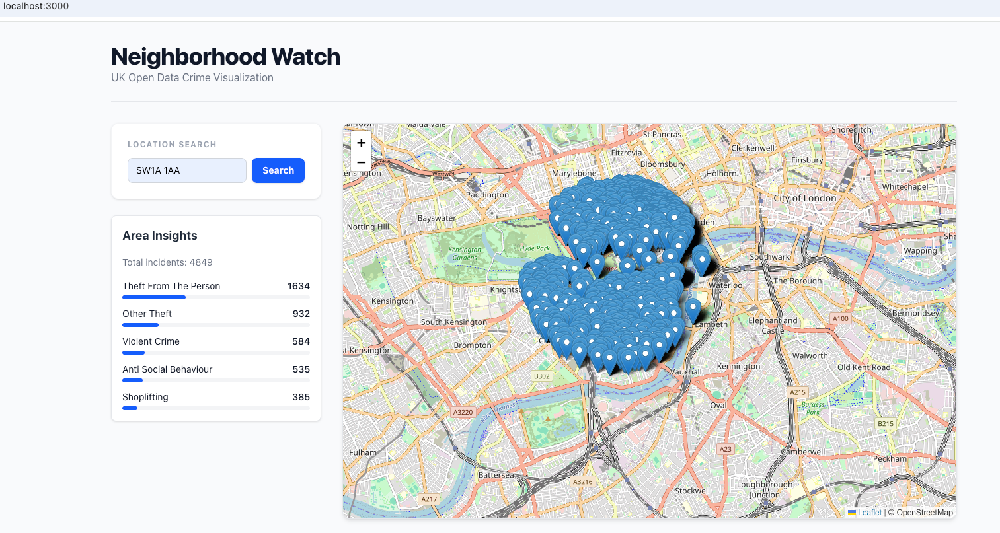

# Neighborhood Watch Intelligence

A full-stack crime visualization dashboard using Next.js, React, and NestJS. It pulls real-time data from the UK Police Open Data API to map crime incidents by postcode.



## Key Features

* **Postcode Search:** Instant mapping and smooth navigation for any UK location.
* **Live Stats:** Sidebar breakdown of the top 5 crime categories in the searched area.
* **Interactive Map:** Dynamic map markers providing street-level incident details.
* **Modern UI:** Built with TailwindCSS and a fully responsive grid layout.

## Technical Integration

* **Real-time Data:** Integrated with the Police.uk API for live crime statistics.
* **Optimized Mapping:** Custom Leaflet implementation designed for high-performance data rendering.
* **Resilient Architecture:** Full-stack TypeScript integration ensuring type safety across the frontend and backend.

## Tech Stack

* **Frontend:** Next.js 15, React 19, Leaflet, TailwindCSS 4
* **Backend:** NestJS, Axios
* **Data Source:** Police.uk Data API

## Quick Start

### 1. Backend (Data API)

```bash
cd backend
npm install
npm run start:dev
```

The API will run on http://localhost:3001

### 2. Frontend (Dashboard)

```bash
cd frontend
npm install --legacy-peer-deps
npm run dev
```

The Dashboard will run on http://localhost:3000

## Usage

1. Enter a valid UK Postcode (e.g., SW1A 1AA or M1 1AG).
2. Click Search to view the location on the map.
3. View crime categories in the Area Insights sidebar.
4. Click map markers to see specific incident locations.